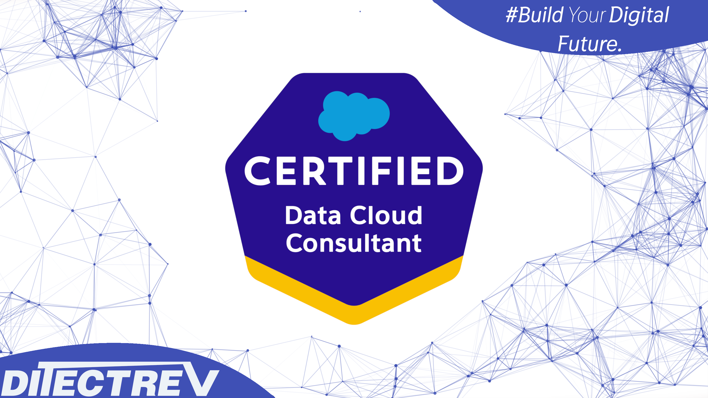

# ⬆️ Salesforce Certified Data Cloud Consultant Practice Tests Exams Questions & Answers

## Table of Contents

| No. | Questions |
| --- | --------- |
| 1   | [What does the `Source Sequence` reconciliation rule do in `Identity Resolution`?](#what-does-the-source-sequence-reconciliation-rule-do-in-identity-resolution) |
| 2   | [Cumulus Financial uses `Data Cloud` to segment banking customers and activate them for direct mail via a Cloud File Storage activation. The company also wants to analyze individuals who have been in the segment within the last 2 years. Which `Data Cloud` component allows for this?](#cumulus-financial-uses-data-cloud-to-segment-banking-customers-and-activate-them-for-direct-mail-via-a-cloud-file-storage-activation-the-company-also-wants-to-analyze-individuals-who-have-been-in-the-segment-within-the-last-2-years-which-data-cloud-component-allows-for-this) |
| 3   | [How can a consultant modify attribute names to match a naming convention in Cloud File Storage targets?](#how-can-a-consultant-modify-attribute-names-to-match-a-naming-convention-in-cloud-file-storage-targets) |
| 4   | [A customer has a Master Customer table from their CRM to ingest into `Data Cloud`. The table contains a name and primary email address, along with other Personally Identifiable Information (PII). How should the fields be mapped to support `Identity Resolution`?](#a-customer-has-a-master-customer-table-from-their-crm-to-ingest-into-data-cloud-the-table-contains-a-name-and-primary-email-address-along-with-other-personally-identifiable-information-pii-how-should-the-fields-be-mapped-to-support-identity-resolution) |
| 5   | [A customer wants to use the transactional data from their data warehouse in `Data Cloud`. They are only able to export the data via an `SFTP` site. How should the file be brought into `Data Cloud`?](#a-customer-wants-to-use-the-transactional-data-from-their-data-warehouse-in-data-cloud-they-are-only-able-to-export-the-data-via-an-sftp-site-how-should-the-file-be-brought-into-data-cloud) |
| 6   | [Cumulus Financial is currently using `Data Cloud` and ingesting transactional data from its backend system via an `S3 Connector` in `Upsert` mode. During the initial setup six months ago, the company created a formula field in `Data Cloud` to create a custom classification. It now needs to update this formula to account for more classifications. What should the consultant keep in mind with regard to formula field updates when using the `S3 Connector`?](#cumulus-financial-is-currently-using-data-cloud-and-ingesting-transactional-data-from-its-backend-system-via-an-s3-connector-in-upsert-mode-during-the-initial-setup-six-months-ago-the-company-created-a-formula-field-in-data-cloud-to-create-a-custom-classification-it-now-needs-to-update-this-formula-to-account-for-more-classifications-what-should-the-consultant-keep-in-mind-with-regard-to-formula-field-updates-when-using-the-s3-connector) |
| 7   | [Northern Trail Outfitters wants to implement `Data Cloud` and has several use cases in mind. Which two use cases are considered a good fit for `Data Cloud`?](#northern-trail-outfitters-wants-to-implement-data-cloud-and-has-several-use-cases-in-mind-which-two-use-cases-are-considered-a-good-fit-for-data-cloud) |
| 8   | [What should an organization use to stream inventory levels from an inventory management system into `Data Cloud` in a fast and scalable, near-real-time way?](#what-should-an-organization-use-to-stream-inventory-levels-from-an-inventory-management-system-into-data-cloud-in-a-fast-and-scalable-near-real-time-way) |
| 9   | [A customer is trying to activate data from `Data Cloud` to an Amazon S3 Cloud File Storage Bucket. Which authentication type should the consultant recommend to connect to the S3 bucket from `Data Cloud`?](#a-customer-is-trying-to-activate-data-from-data-cloud-to-an-amazon-s3-cloud-file-storage-bucket-which-authentication-type-should-the-consultant-recommend-to-connect-to-the-s3-bucket-from-data-cloud) |
| 10  | [Northern Trail Outfitters (NTO) wants to connect their B2C Commerce data with `Data Cloud` and bring two years of transactional history into `Data Cloud`. What should NTO use to achieve this?](#northern-trail-outfitters-nto-wants-to-connect-their-b2c-commerce-data-with-data-cloud-and-bring-two-years-of-transactional-history-into-data-cloud-what-should-nto-use-to-achieve-this) |
| 11  | [Cumulus Financial uses Service Cloud as its CRM and stores `Mobile Phone`, `Home Phone`, and `Work Phone` as three separate fields for its customers on the `Contact` record. The company plans to use `Data Cloud` and ingest the `Contact` object via the CRM Connector. What is the most efficient approach that a consultant should take when ingesting this data to ensure all the different phone numbers are properly mapped and available for use in activation?](#cumulus-financial-uses-service-cloud-as-its-crm-and-stores-mobile-phone-home-phone-and-work-phone-as-three-separate-fields-for-its-customers-on-the-contact-record-the-company-plans-to-use-data-cloud-and-ingest-the-contact-object-via-the-crm-connector-what-is-the-most-efficient-approach-that-a-consultant-should-take-when-ingesting-this-data-to-ensure-all-the-different-phone-numbers-are-properly-mapped-and-available-for-use-in-activation) |
| 12  | [To import campaign members into a campaign in Salesforce CRM, a user wants to export the segment to Amazon S3. The resulting file needs to include the Salesforce CRM Campaign ID in the name. What are two ways to achieve this outcome?](#to-import-campaign-members-into-a-campaign-in-salesforce-crm-a-user-wants-to-export-the-segment-to-amazon-s3-the-resulting-file-needs-to-include-the-salesforce-crm-campaign-id-in-the-name-what-are-two-ways-to-achieve-this-outcome) |
| 13  | [A customer is concerned that the consolidation rate displayed in the `Identity Resolution` is quite low compared to their initial estimations. Which configuration change should a consultant consider in order to increase the consolidation rate?](#a-customer-is-concerned-that-the-consolidation-rate-displayed-in-the-identity-resolution-is-quite-low-compared-to-their-initial-estimations-which-configuration-change-should-a-consultant-consider-in-order-to-increase-the-consolidation-rate) |
| 14  | [A customer has a requirement to receive a notification whenever an activation fails for a particular segment. Which feature should the consultant use to solution for this use case?](#a-customer-has-a-requirement-to-receive-a-notification-whenever-an-activation-fails-for-a-particular-segment-which-feature-should-the-consultant-use-to-solution-for-this-use-case) |
| 15  | [Which data model subject area defines the revenue or quantity for an opportunity by product family?](#which-data-model-subject-area-defines-the-revenue-or-quantity-for-an-opportunity-by-product-family) |
| 16  | [When performing segmentation or activation, which time zone is used to publish and refresh data?](#when-performing-segmentation-or-activation-which-time-zone-is-used-to-publish-and-refresh-data) |
| 17  | [Northern Trail Outfitters (NTO), an outdoor lifestyle clothing brand, recently started a new line of business. The new business specializes in gourmet camping food. For business reasons as well as security reasons, it's important to NTO to keep all `Data Cloud` data separated by brand. Which capability best supports NTO's desire to separate its data by brand?](#northern-trail-outfitters-nto-an-outdoor-lifestyle-clothing-brand-recently-started-a-new-line-of-business-the-new-business-specializes-in-gourmet-camping-food-for-business-reasons-as-well-as-security-reasons-its-important-to-nto-to-keep-all-data-cloud-data-separated-by-brand-which-capability-best-supports-ntos-desire-to-separate-its-data-by-brand) |
| 18  | [A `Data Cloud` customer wants to adjust their `Identity Resolution` rules to increase their accuracy of matches. Rather than matching on email address, they want to review a rule that joins their CRM Contacts with their Marketing Contacts, where both use the `CRM ID` as their primary key. Which two steps should the consultant take to address this new use case?](#a-data-cloud-customer-wants-to-adjust-their-identity-resolution-rules-to-increase-their-accuracy-of-matches-rather-than-matching-on-email-address-they-want-to-review-a-rule-that-joins-their-crm-contacts-with-their-marketing-contacts-where-both-use-the-crm-id-as-their-primary-key-which-two-steps-should-the-consultant-take-to-address-this-new-use-case) |
| 19  | [Cumulus Financial created a segment called `High Investment Balance Customers`. This is a foundational segment that includes several segmentation criteria the marketing team should consistently use. Which feature should the consultant suggest the marketing team use to ensure this consistency when creating future, more refined segments?](#cumulus-financial-created-a-segment-called-high-investment-balance-customers-this-is-a-foundational-segment-that-includes-several-segmentation-criteria-the-marketing-team-should-consistently-use-which-feature-should-the-consultant-suggest-the-marketing-team-use-to-ensure-this-consistency-when-creating-future-more-refined-segments) |
| 20  | [What does it mean to build a trust-based, first-party data asset?](#what-does-it-mean-to-build-a-trust-based-first-party-data-asset) |
| 21  | [Which two dependencies prevent a data stream from being deleted?](#which-two-dependencies-prevent-a-data-stream-from-being-deleted) |
| 22  | [What is `Data Cloud`'s primary value to customers?](#what-is-data-clouds-primary-value-to-customers) |
| 23  | [Which consideration related to the way `Data Cloud` ingests CRM data is true?](#which-consideration-related-to-the-way-data-cloud-ingests-crm-data-is-true) |
| 24  | [During a privacy law discussion with a customer, the customer indicates they need to honor requests for the `Right to be Forgotten`. The consultant determines that `Consent API` will solve this business need. Which two considerations should the consultant inform the customer about?](#during-a-privacy-law-discussion-with-a-customer-the-customer-indicates-they-need-to-honor-requests-for-the-right-to-be-forgotten-the-consultant-determines-that-consent-api-will-solve-this-business-need-which-two-considerations-should-the-consultant-inform-the-customer-about) |
| 25  | [Which permission setting should a consultant check if the custom Salesforce CRM object is not available in New Data Stream configuration?](#which-permission-setting-should-a-consultant-check-if-the-custom-salesforce-crm-object-is-not-available-in-new-data-stream-configuration) |
| 26  | [Where is `Value Suggestion` for attributes in segmentation enabled when creating the DMO?](#where-is-value-suggestion-for-attributes-in-segmentation-enabled-when-creating-the-dmo) |
| 27  | [Which two steps should a consultant take if a successfully configured Amazon S3 data stream fails to refresh with a `NO FILE FOUND` error message?](#which-two-steps-should-a-consultant-take-if-a-successfully-configured-amazon-s3-data-stream-fails-to-refresh-with-a-no-file-found-error-message) |
| 28  | [What is the result of a segmentation criteria filtering on `City \| Is Equal To \| 'San José'`?](#what-is-the-result-of-a-segmentation-criteria-filtering-on-city--is-equal-to--san-josé) |
| 29  | [Northern Trail Outfitters wants to use some of its `Marketing Cloud data` in `Data Cloud`. Which engagement channel data will require custom integration?](#northern-trail-outfitters-wants-to-use-some-of-its-marketing-cloud-data-in-data-cloud-which-engagement-channel-data-will-require-custom-integration) |
| 30  | [What should a user do to pause a segment activation with the intent of using that segment again?](#what-should-a-user-do-to-pause-a-segment-activation-with-the-intent-of-using-that-segment-again) |
| 31  | [Which configuration supports separate Amazon S3 buckets for data ingestion and activation?](#which-configuration-supports-separate-amazon-s3-buckets-for-data-ingestion-and-activation) |
| 32  | [Luxury Retailers created a segment targeting high value customers that it activates through `Marketing Cloud` for email communication. The company notices that the activated count is smaller than the segment count. What is a reason for this?](#luxury-retailers-created-a-segment-targeting-high-value-customers-that-it-activates-through-marketing-cloud-for-email-communication-the-company-notices-that-the-activated-count-is-smaller-than-the-segment-count-what-is-a-reason-for-this) |
| 33  | [When creating a segment on an individual, what is the result of using two separate containers linked by an AND as shown below? `GoodsProduct \| Count \| At Least \| 1 Color \| Is Equal To \| red AND GoodsProduct \| Count \| At Least \| 1 PrimaryProductCategory \| Is Equal To \| shoes`](#when-creating-a-segment-on-an-individual-what-is-the-result-of-using-two-separate-containers-linked-by-an-and-as-shown-below-goodsproduct--count--at-least--1-color--is-equal-to--red-and-goodsproduct--count--at-least--1-primaryproductcategory--is-equal-to--shoes) |
| 34  | [Cloud Kicks received a `Request to be Forgotten` by a customer. In which two ways should a consultant use `Data Cloud` to honor this request?](#cloud-kicks-received-a-request-to-be-forgotten-by-a-customer-in-which-two-ways-should-a-consultant-use-data-cloud-to-honor-this-request) |
| 35  | [A retailer wants to unify profiles using Loyalty ID which is different than the unique ID of their customers. Which object should the consultant use in `Identity Resolution` to perform exact match rules on the Loyalty ID?](#a-retailer-wants-to-unify-profiles-using-loyalty-id-which-is-different-than-the-unique-id-of-their-customers-which-object-should-the-consultant-use-in-identity-resolution-to-perform-exact-match-rules-on-the-loyalty-id) |
| 36  | [A consultant has an activation that is set to publish every 12 hours, but has discovered that updates to the data prior to activation are delayed by up to 24 hours. Which two areas should a consultant review to troubleshoot this issue?](#a-consultant-has-an-activation-that-is-set-to-publish-every-12-hours-but-has-discovered-that-updates-to-the-data-prior-to-activation-are-delayed-by-up-to-24-hours-which-two-areas-should-a-consultant-review-to-troubleshoot-this-issue) |
| 37  | [Cumulus Financial wants to segregate Salesforce CRM Account data based on `Country` for its `Data Cloud` users. What should the consultant do to accomplish this?](#cumulus-financial-wants-to-segregate-salesforce-crm-account-data-based-on-country-for-its-data-cloud-users-what-should-the-consultant-do-to-accomplish-this) |
| 38  | [A customer notices that their consolidation rate has recently increased. They contact the consultant to ask why. What are two likely explanations for the increase?](#a-customer-notices-that-their-consolidation-rate-has-recently-increased-they-contact-the-consultant-to-ask-why-what-are-two-likely-explanations-for-the-increase) |
| 39  | [`Data Cloud` consultant recently discovered that their `Identity Resolution` process is matching individuals that share email addresses or phone numbers, but are not actually the same individual. What should the consultant do to address this issue?](#data-cloud-consultant-recently-discovered-that-their-identity-resolution-process-is-matching-individuals-that-share-email-addresses-or-phone-numbers-but-are-not-actually-the-same-individual-what-should-the-consultant-do-to-address-this-issue) |
| 40  | [`Data Cloud` receives a nightly file of all ecommerce transactions from the previous day. Several segments and activations depend upon `Calculated Insights` from the updated data in order to maintain accuracy in the customer's scheduled campaign messages. What should the consultant do to ensure the ecommerce data is ready for use for each of the scheduled activations?](#data-cloud-receives-a-nightly-file-of-all-ecommerce-transactions-from-the-previous-day-several-segments-and-activations-depend-upon-calculated-insights-from-the-updated-data-in-order-to-maintain-accuracy-in-the-customers-scheduled-campaign-messages-what-should-the-consultant-do-to-ensure-the-ecommerce-data-is-ready-for-use-for-each-of-the-scheduled-activations) |
| 41  | [A client wants to bring in loyalty data from a custom object in Salesforce CRM that contains a point balance for accrued hotel points and airline points within the same record. The client wants to split these point systems into two separate records for better tracking and processing. What should a consultant recommend in this scenario?](#a-client-wants-to-bring-in-loyalty-data-from-a-custom-object-in-salesforce-crm-that-contains-a-point-balance-for-accrued-hotel-points-and-airline-points-within-the-same-record-the-client-wants-to-split-these-point-systems-into-two-separate-records-for-better-tracking-and-processing-what-should-a-consultant-recommend-in-this-scenario) |
| 42  | [Which operator should a consultant use to create a segment for a birthday campaign that is evaluated daily?](#which-operator-should-a-consultant-use-to-create-a-segment-for-a-birthday-campaign-that-is-evaluated-daily) |
| 43  | [A new user of `Data Cloud` only needs to be able to review individual rows of ingested data and validate that it has been modeled successfully to its linked Data Model Object. The user will also need to make changes if required. What is the minimum permission set needed to accommodate this use case?](#a-new-user-of-data-cloud-only-needs-to-be-able-to-review-individual-rows-of-ingested-data-and-validate-that-it-has-been-modeled-successfully-to-its-linked-data-model-object-the-user-will-also-need-to-make-changes-if-required-what-is-the-minimum-permission-set-needed-to-accommodate-this-use-case) |
| 44  | [A consultant is discussing the benefits of `Data Cloud` with a customer that has multiple disjointed data sources. Which two functional areas should the consultant highlight in relation to managing customer data?](#a-consultant-is-discussing-the-benefits-of-data-cloud-with-a-customer-that-has-multiple-disjointed-data-sources-which-two-functional-areas-should-the-consultant-highlight-in-relation-to-managing-customer-data) |
| 45  | [Northern Trail Outfitters is using the `Marketing Cloud Starter Data Bundles` to bring `Marketing Cloud` data into `Data Cloud`. What are two of the available datasets in `Marketing Cloud Starter Data Bundles`?](#northern-trail-outfitters-is-using-the-marketing-cloud-starter-data-bundles-to-bring-marketing-cloud-data-into-data-cloud-what-are-two-of-the-available-datasets-in-marketing-cloud-starter-data-bundles) |
| 46  | [Northern Trail Outfitters unifies individuals in its `Data Cloud` instance. Which three features can the consultant use to validate the data on a unified profile?](#northern-trail-outfitters-unifies-individuals-in-its-data-cloud-instance-which-three-features-can-the-consultant-use-to-validate-the-data-on-a-unified-profile) |
| 47  | [A consultant is integrating an Amazon S3 activated campaign with the customer's destination system. In order for the destination system to find the metadata about the segment, which file on the S3 will contain this information for processing?](#a-consultant-is-integrating-an-amazon-s3-activated-campaign-with-the-customers-destination-system-in-order-for-the-destination-system-to-find-the-metadata-about-the-segment-which-file-on-the-s3-will-contain-this-information-for-processing) |
| 48  | [Which information is provided in a `.csv` file when activating to Amazon S3?](#which-information-is-provided-in-a-csv-file-when-activating-to-amazon-s3) |
| 49  | [Which two common use cases can be addressed with `Data Cloud`?](#which-two-common-use-cases-can-be-addressed-with-data-cloud) |
| 50  | [Northern Trail Outfitters (NTO) creates a `Calculated Insight` to compute recency, frequency, monetary (RFM) scores on its unified individuals. NTO then creates a segment based on these scores that it activates to a `Marketing Cloud` activation target. Which two actions are required when configuring the activation?](#northern-trail-outfitters-nto-creates-a-calculated-insight-to-compute-recency-frequency-monetary-rfm-scores-on-its-unified-individuals-nto-then-creates-a-segment-based-on-these-scores-that-it-activates-to-a-marketing-cloud-activation-target-which-two-actions-are-required-when-configuring-the-activation) |
| 51  | [Which data model subject area should be used for any `Organization`, `Individual`, or `Member` in the `Customer 360` data model?](#which-data-model-subject-area-should-be-used-for-any-organization-individual-or-member-in-the-customer-360-data-model) |
| 52  | [The Salesforce CRM Connector is configured and the `Case` object data stream is set up. Subsequently, a new custom field named `Business Priority` is created on the `Case` object in Salesforce CRM. However, the new field is not available when trying to add it to the data stream. Which statement addresses the cause of this issue?](#the-salesforce-crm-connector-is-configured-and-the-case-object-data-stream-is-set-up-subsequently-a-new-custom-field-named-business-priority-is-created-on-the-case-object-in-salesforce-crm-however-the-new-field-is-not-available-when-trying-to-add-it-to-the-data-stream-which-statement-addresses-the-cause-of-this-issue) |
| 53  | [The marketing manager at Cloud Kicks plans to bring in corporate phone numbers for its accounts into `Data Cloud`. They plan to use a custom field with data set to Phone to store these phone numbers. Which statement is true when ingesting phone numbers?](#the-marketing-manager-at-cloud-kicks-plans-to-bring-in-corporate-phone-numbers-for-its-accounts-into-data-cloud-they-plan-to-use-a-custom-field-with-data-set-to-phone-to-store-these-phone-numbers-which-statement-is-true-when-ingesting-phone-numbers) |
| 54  | [What is a typical use case for `Salesforce Data Cloud`?](#what-is-a-typical-use-case-for-salesforce-data-cloud) |
| 55  | [A consultant needs to create a data graph based on several DLOs, Which step should the consultant take to make this work?](#a-consultant-needs-to-create-a-data-graph-based-on-several-dlos-which-step-should-the-consultant-take-to-make-this-work) |
| 56  | [Northern Trail Outfitters wants to create a segment with customers that have purchased in the last 24 hours. The segment data must be as up to date as possible. What should the consultant Implement when creating the segment?](#northern-trail-outfitters-wants-to-create-a-segment-with-customers-that-have-purchased-in-the-last-24-hours-the-segment-data-must-be-as-up-to-date-as-possible-what-should-the-consultant-implement-when-creating-the-segment) |
| 57  | [An analyst from Cloud Kicks needs to get quick insights to determine the average sales per day during the past week. What should a consultant recommend?](#an-analyst-from-cloud-kicks-needs-to-get-quick-insights-to-determine-the-average-sales-per-day-during-the-past-weekwhat-should-a-consultant-recommend) |
| 58  | [During an implementation project, a consultant completed ingestion of all data streams for their customer. Prior to segmenting and acting on that data, which additional configuration is required?](#during-an-implementation-project-a-consultant-completed-ingestion-of-all-data-streams-for-their-customer-prior-to-segmenting-and-acting-on-that-data-which-additional-configuration-is-required) |
| 59  | [Northern Trail Qutfitters wants to be able to calculate each customer's lifetime value (LTV) but also create breakdowns of the revenue sourced by website, mobile app, and retail channels. What should a consultant use to address this use case in `Data Cloud`?](#northern-trail-qutfitters-wants-to-be-able-to-calculate-each-customers-lifetime-value-ltv-but-also-create-breakdowns-of-the-revenue-sourced-by-website-mobile-app-and-retail-channels-what-should-a-consultant-use-to-address-this-use-case-in-data-cloud) |
| 60  | [A consultant wants to ensure that every segment managed by multiple brand teams adheres to the same set of axclusion criteria, that are updated on a monthly basis. What is the most efficient option to allow for this capability?](#a-consultant-wants-to-ensure-that-every-segment-managed-by-multiple-brand-teams-adheres-to-the-same-set-of-axclusion-criteria-that-are-updated-on-a-monthly-basis-what-is-the-most-efficient-option-to-allow-for-this-capability) |
| 61  | [A customer needs to integrate in real time with Salesforce CRM. Which feature accomplishes this requirement?](#a-customer-needs-to-integrate-in-real-time-with-salesforce-crm-which-feature-accomplishes-this-requirement) |
| 62  | [A user wants to be able to create a multi-dimensional metric to identify `Unified Individual` lifetime value (LTV). Which sequence of Data Model Object (DMO) joins is necessary within the `Calculated Insight` to enable this calculation?](#a-user-wants-to-be-able-to-create-a-multi-dimensional-metric-to-identify-unified-individual-lifetime-value-ltv-which-sequence-of-data-model-object-dmo-joins-is-necessary-within-the-calculated-insight-to-enable-this-calculation) |
| 63  | [Cumulus Financial created a segment called `Multiple Investments` that contains individuals who have invested in two or more mutual funds. The company plans to send an email to this segment regarding a new mutual fund offering, and wants to personalize the email content with information about each customer's current mutual fund investments. How should the `Data Cloud` consultant configure this activation?](#cumulus-financial-created-a-segment-called-multiple-investments-that-contains-individuals-who-have-invested-in-two-or-more-mutual-funds-the-company-plans-to-send-an-email-to-this-segment-regarding-a-new-mutual-fund-offering-and-wants-to-personalize-the-email-content-with-information-about-each-customers-current-mutual-fund-investments-how-should-the-data-cloud-consultant-configure-this-activation) |
| 64  | [A segment fails to refresh with the error `Segment references too many data lake objects (DLOs)`. Which two troubleshooting tips should help remedy this issue?](#a-segment-fails-to-refresh-with-the-error-segment-references-too-many-data-lake-objects-dlos-which-two-troubleshooting-tips-should-help-remedy-this-issue) |
| 65  | [An organization wants to enable users with the ability to identify and select text attributes from a picklist of options. Which `Data Cloud` feature should help with this use case?](#an-organization-wants-to-enable-users-with-the-ability-to-identify-and-select-text-attributes-from-a-picklist-of-options-which-data-cloud-feature-should-help-with-this-use-case) |
| 66  | [A consultant is working in a customer's `Data Cloud` org and is asked to delete the existing `Identity Resolution` ruleset. Which two impacts should the consultant communicate as a result of this action?](#a-consultant-is-working-in-a-customers-data-cloud-org-and-is-asked-to-delete-the-existing-identity-resolution-ruleset-which-two-impacts-should-the-consultant-communicate-as-a-result-of-this-action) |
| 67  | [Northern Trail Outfitters uploads new customer data to an Amazon S3 Bucket on a daily basis to be ingested in `Data Cloud`. In what order should each process be run to ensure that freshly imported data is ready and available to use for any segment?](#northern-trail-outfitters-uploads-new-customer-data-to-an-amazon-s3-bucket-on-a-daily-basis-to-be-ingested-in-data-cloud-in-what-order-should-each-process-be-run-to-ensure-that-freshly-imported-data-is-ready-and-available-to-use-for-any-segment) |
| 68  | [Which two requirements must be met for a `Calculated Insight` to appear in the segmentation canvas?](#which-two-requirements-must-be-met-for-a-calculated-insight-to-appear-in-the-segmentation-canvas) |
| 69  | [A customer requests that their personal data be deleted. Which action should the consultant take to accommodate this request in `Data Cloud`?](#a-customer-requests-that-their-personal-data-be-deleted-which-action-should-the-consultant-take-to-accommodate-this-request-in-data-cloud) |
| 70  | [What does the `Ignore Empty Value` option do in `Identity Resolution`?](#what-does-the-ignore-empty-value-option-do-in-identity-resolution) |
| 71  | [Northern Trail Outfitters (NTO) is configuring an `Identity Resolution` ruleset based on `Fuzzy Name` and `Normalized Email`. What should NTO do to ensure the best email address is activated?](#northern-trail-outfitters-nto-is-configuring-an-identity-resolution-ruleset-based-on-fuzzy-name-and-normalized-email-what-should-nto-do-to-ensure-the-best-email-address-is-activated) |
| 72  | [A customer wants to create segments of users based on their `Customer Lifetime Value`. However, the source data that will be brought into `Data Cloud` does not include that key performance indicator (KPI). Which sequence of steps should the consultant follow to achieve this requirement?](#a-customer-wants-to-create-segments-of-users-based-on-their-customer-lifetime-value-however-the-source-data-that-will-be-brought-into-data-cloud-does-not-include-that-key-performance-indicator-kpi-which-sequence-of-steps-should-the-consultant-follow-to-achieve-this-requirement) |
| 73  | [During discovery, which feature should a consultant highlight for a customer who has multiple data sources and needs to match and reconcile data about individuals into a single unified profile?](#during-discovery-which-feature-should-a-consultant-highlight-for-a-customer-who-has-multiple-data-sources-and-needs-to-match-and-reconcile-data-about-individuals-into-a-single-unified-profile) |
| 74  | [Northern Trail Outfitters (NTO) wants to send a promotional campaign for customers that have purchased within the past 6 months. The consultant created a segment to meet this requirement. Now, NTO brings an additional requirement to suppress customers who have made purchases within the last week. What should the consultant use to remove the recent customers?](#northern-trail-outfitters-nto-wants-to-send-a-promotional-campaign-for-customers-that-have-purchased-within-the-past-6-months-the-consultant-created-a-segment-to-meet-this-requirement-now-nto-brings-an-additional-requirement-to-suppress-customers-who-have-made-purchases-within-the-last-week-what-should-the-consultant-use-to-remove-the-recent-customers) |
| 75  | [Which data stream category should be assigned to use the data for time-based operations is segmentation and `Calculated Insights`?](#which-data-stream-category-should-be-assigned-to-use-the-data-for-time-based-operations-is-segmentation-and-calculated-insights) |
| 76  | [Which method should a consultant use when performing aggregations in windows of 15 minutes on data collected via the `Interaction SDK` or `Mobile SDK`?](#which-method-should-a-consultant-use-when-performing-aggregations-in-windows-of-15-minutes-on-data-collected-via-the-interaction-sdk-or-mobile-sdk) |
| 77  | [A customer has a custom `Customer Email c` object related to the standard `Contact` object in Salesforce CRM. This custom object stores the email address a Contact that they want to use for activation. To which data entity is mapped?](#a-customer-has-a-custom-customer-email-c-object-related-to-the-standard-contact-object-in-salesforce-crm-this-custom-object-stores-the-email-address-a-contact-that-they-want-to-use-for-activation-to-which-data-entity-is-mapped) |
| 78  | [Every day, Northern Trail Outfitters uploads a summary of the last 24 hours of store transactions to a new file in an Amazon S3 bucket, and files older than seven days are automatically deleted. Each file contains a timestamp in a standardized naming convention. Which two options should a consultant configure when ingesting this data stream?](#every-day-northern-trail-outfitters-uploads-a-summary-of-the-last-24-hours-of-store-transactions-to-a-new-file-in-an-amazon-s3-bucket-and-files-older-than-seven-days-are-automatically-deleted-each-file-contains-a-timestamp-in-a-standardized-naming-convention-which-two-options-should-a-consultant-configure-when-ingesting-this-data-stream) |
| 79  | [Which solution provides an easy way to ingest `Marketing Cloud` subscriber profile attributes into `Data Cloud` on a daily basis?](#which-solution-provides-an-easy-way-to-ingest-marketing-cloud-subscriber-profile-attributes-into-data-cloud-on-a-daily-basis) |
| 80  | [A customer has a requirement to be able to view the last time each segment was published within their `Data Cloud` org. Which two features should the consultant recommend to best address this requirement?](#a-customer-has-a-requirement-to-be-able-to-view-the-last-time-each-segment-was-published-within-their-data-cloud-org-which-two-features-should-the-consultant-recommend-to-best-address-this-requirement) |
| 81  | [A `Data Cloud` consultant recently added a new data source and mapped some of the data to a new custom Data Model Object (DMO) that they want to use for creating segments. However, they cannot view the newly created DMO when trying to create a new segment. What is the cause of this issue?](#a-data-cloud-consultant-recently-added-a-new-data-source-and-mapped-some-of-the-data-to-a-new-custom-data-model-object-dmo-that-they-want-to-use-for-creating-segments-however-they-cannot-view-the-newly-created-dmo-when-trying-to-create-a-new-segment-what-is-the-cause-of-this-issue) |
| 82  | [How does `Data Cloud` handle an individual's `Right to be Forgotten`?](#how-does-data-cloud-handle-an-individuals-right-to-be-forgotten) |
| 83  | [A healthcare client wants to make use of `Identity Resolution`, but does not want to risk unifying profiles that may share certain Personally Identifiable Information (PII). Which matching rule criteria should a consultant recommend for the most accurate matching results?](#a-healthcare-client-wants-to-make-use-of-identity-resolution-but-does-not-want-to-risk-unifying-profiles-that-may-share-certain-personally-identifiable-information-pii-which-matching-rule-criteria-should-a-consultant-recommend-for-the-most-accurate-matching-results) |
| 84  | [A user is not seeing suggested values from newly-modeled data when building a segment. What is causing this issue?](#a-user-is-not-seeing-suggested-values-from-newly-modeled-data-when-building-a-segment-what-is-causing-this-issue) |
| 85  | [A consultant is building a segment to announce a new product launch for customers that have previously purchased black pants. How should the consultant place attributes for product color and product type from the `Order Product` object to meet this criteria?](#a-consultant-is-building-a-segment-to-announce-a-new-product-launch-for-customers-that-have-previously-purchased-black-pants-how-should-the-consultant-place-attributes-for-product-color-and-product-type-from-the-order-product-object-to-meet-this-criteria) |
| 86  | [Cumulus Financial wants to be able to track the daily transaction volume of each of its customers in real time and send out a notification as soon as it detects volume outside a customer's normal range. What should a consultant do to accommodate this request?](#cumulus-financial-wants-to-be-able-to-track-the-daily-transaction-volume-of-each-of-its-customers-in-real-time-and-send-out-a-notification-as-soon-as-it-detects-volume-outside-a-customers-normal-range-what-should-a-consultant-do-to-accommodate-this-request) |
| 87  | [Cumulus Financial uses `Calculated Insights` to compute the total banking value per branh for its high net worth customers. In the `Calculated Insight`, `banking value` is a metric, `branch` is a dimension, and `high net worth` is a filter. What can be included as an attribute in activation?](#cumulus-financial-uses-calculated-insights-to-compute-the-total-banking-value-per-branh-for-its-high-net-worth-customers-in-the-calculated-insight-banking-value-is-a-metric-branch-is-a-dimension-and-high-net-worth-is-a-filter-what-can-be-included-as-an-attribute-in-activation) |
| 88  | [Cloud Kicks wants to be able to build a segment of customers who have visited its website within the previous 7 days. Which filter operator on the `Engagement Date` fields fits this use case?](#cloud-kicks-wants-to-be-able-to-build-a-segment-of-customers-who-have-visited-its-website-within-the-previous-7-days-which-filter-operator-on-the-engagement-date-fields-fits-this-use-case) |
| 89  | [Northern Trail Outfitters (NTO) owns and operates six unique brands, each with their own set of customers, transactions, and loyalty information. The marketing director wants to ensure that segments and activations from the NTO `Outlet` brand do not reference customers or transactions from the other brands. What is the most efficient approach to handle this requirement?](#northern-trail-outfitters-nto-owns-and-operates-six-unique-brands-each-with-their-own-set-of-customers-transactions-and-loyalty-information-the-marketing-director-wants-to-ensure-that-segments-and-activations-from-the-nto-outlet-brand-do-not-reference-customers-or-transactions-from-the-other-brands-what-is-the-most-efficient-approach-to-handle-this-requirement) |
| 90  | [A retail customer wants to bring customer data from different sources and wants to take advantage of `Identity Resolution` so that it can be used in segmentation. On which entity should this be segmented for activation membership?](#a-retail-customer-wants-to-bring-customer-data-from-different-sources-and-wants-to-take-advantage-of-identity-resolution-so-that-it-can-be-used-in-segmentation-on-which-entity-should-this-be-segmented-for-activation-membership) |
| 91  | [A consultant is reviewing a recent activation using engagement-based related attributes but is not seeing any related attributes in their payload for the majority of their segment members. Which two areas should the consultant review to help troubleshoot this issue?](#a-consultant-is-reviewing-a-recent-activation-using-engagement-based-related-attributes-but-is-not-seeing-any-related-attributes-in-their-payload-for-the-majority-of-their-segment-members-which-two-areas-should-the-consultant-review-to-help-troubleshoot-this-issue) |
| 92  | [Northern Trail Outfitters uses B2C Commerce and is exploring implementing `Data Cloud` to get a unified view of its customers and all their order transactions. What should the consultant keep in mind with regard to historical data when ingesting order data using the B2C Commerce Order Bundle?](#northern-trail-outfitters-uses-b2c-commerce-and-is-exploring-implementing-data-cloud-to-get-a-unified-view-of-its-customers-and-all-their-order-transactions-what-should-the-consultant-keep-in-mind-with-regard-to-historical-data-when-ingesting-order-data-using-the-b2c-commerce-order-bundle) |
| 93  | [A company wants to test its marketing campaigns with different target populations. What should the consultant adjust in the `Segment Canvas` interface to get different populations?](#a-company-wants-to-test-its-marketing-campaigns-with-different-target-populations-what-should-the-consultant-adjust-in-the-segment-canvas-interface-to-get-different-populations)
| 94  | [Cumulus Financial wants its service agents to view a display of all cases associated with a `Unified Individual` on a contract record. Which two features should a consultant consider for this use case? (Choose two.)](#cumulus-financial-wants-its-service-agents-to-view-a-display-of-all-cases-associated-with-a-unified-individual-on-a-contract-record-which-two-features-should-a-consultant-consider-for-this-use-case-choose-two)
| 95  | [A consultant is planning the ingestion of a data stream that has profile information including a mobile phone number. To ensure that the phone number can be used for future SMS campaigns, they need to confirm the phone number field is in the proper `E164` Phone Number format. However, the phone numbers in the file appear to be in varying formats. What is the most efficient way to guarantee that the various phone number formats are standardized?](#a-consultant-is-planning-the-ingestion-of-a-data-stream-that-has-profile-information-including-a-mobile-phone-number-to-ensure-that-the-phone-number-can-be-used-for-future-sms-campaigns-they-need-to-confirm-the-phone-number-field-is-in-the-proper-e164-phone-number-format-however-the-phone-numbers-in-the-file-appear-to-be-in-varying-formats-what-is-the-most-efficient-way-to-guarantee-that-the-various-phone-number-formats-are-standardized)
| 96  | [A consultant notices that the unified individual profile is not storing the latest email address. Which action should the consultant take to troubleshoot this issue?](#a-consultant-notices-that-the-unified-individual-profile-is-not-storing-the-latest-email-address-which-action-should-the-consultant-take-to-troubleshoot-this-issue)
| 97  | [A customer has a `Calculated Insight` about lifetime value. What does the consultant need to be aware of if the `Calculated Insight` needs to be modified?](#a-customer-has-a-calculated-insight-about-lifetime-value-what-does-the-consultant-need-to-be-aware-of-if-the-calculated-insight-needs-to-be-modified)
| 98  | [Every day, Northern Trail Outfitters (NTO) uploads a summary of the last 24 hours of store transactions to a new file in an Amazon S3 bucket, and files older than 7 days are automatically deleted. Each file contains a timestamp in a standardized naming convention. What should a consultant consider when ingesting this data stream?](#every-day-northern-trail-outfitters-nto-uploads-a-summary-of-the-last-24-hours-of-store-transactions-to-a-new-file-in-an-amazon-s3-bucket-and-files-older-than-7-days-are-automatically-deleted-each-file-contains-a-timestamp-in-a-standardized-naming-convention-what-should-a-consultant-consider-when-ingesting-this-data-stream)
| 99  | [A consultant needs to publish segment data to the Audience DMO that can be retrieved using the Query APIs. When creating the activation target, which type of target should the consultant select?](#a-consultant-needs-to-publish-segment-data-to-the-audience-dmo-that-can-be-retrieved-using-the-query-apis-when-creating-the-activation-target-which-type-of-target-should-the-consultant-select)

### What does the `Source Sequence` reconciliation rule do in `Identity Resolution`?

- [ ] Includes data from sources where the data is most frequently occurring.
- [ ] Identifies which individual records should be merged into a unified profile by setting a priority for specific data sources.
- [ ] Identifies which data sources should be used in the process of reconcillation by prioritizing the most recently updated data sourc.
- [x] Sets the priority of specific data sources when building attributes in a unified profile, such as a
first or last name.

**[⬆ Back to Top](#table-of-contents)**

### Cumulus Financial uses `Data Cloud` to segment banking customers and activate them for direct mail via a Cloud File Storage activation. The company also wants to analyze individuals who have been in the segment within the last 2 years. Which `Data Cloud` component allows for this?

- [ ] Segment exclusion.
- [ ] Nested segments.
- [x] Segment membership Data Model Object.
- [ ] `Calculated Insights`.

**[⬆ Back to Top](#table-of-contents)**

### How can a consultant modify attribute names to match a naming convention in Cloud File Storage targets?

- [ ] Use a formula field to update the field name in an activation.
- [ ] Update attribute names in the data stream configuration.
- [x] Set preferred attribute names when configuring activation.
- [ ] Update field names in the Data Model Object.

**[⬆ Back to Top](#table-of-contents)**

### A customer has a Master Customer table from their CRM to ingest into `Data Cloud`. The table contains a name and primary email address, along with other Personally Identifiable Information (PII). How should the fields be mapped to support `Identity Resolution`?

- [ ] Create a new custom object with fields that directly match the incoming table.
- [ ] Map all fields to the `Customer` object.
- [x] Map name to the `Individual` object and email address to the `Contact Point Email` object.
- [ ] Map all fields to the `Individual` object, adding a custom field for the email address.

**[⬆ Back to Top](#table-of-contents)**

### A customer wants to use the transactional data from their data warehouse in `Data Cloud`. They are only able to export the data via an `SFTP` site. How should the file be brought into `Data Cloud`?

- [x] Ingest the file with the `SFTP Connector`.
- [ ] Ingest the file through the `Cloud Storage Connector`.
- [ ] Manually import the file using the `Data Import Wizard`.
- [ ] Use Salesforce's `Data Loader` application to perform a bulk upload from a desktop.

**[⬆ Back to Top](#table-of-contents)**

### Cumulus Financial is currently using `Data Cloud` and ingesting transactional data from its backend system via an `S3 Connector` in `Upsert` mode. During the initial setup six months ago, the company created a formula field in `Data Cloud` to create a custom classification. It now needs to update this formula to account for more classifications. What should the consultant keep in mind with regard to formula field updates when using the `S3 Connector`?

- [ ] `Data Cloud` will initiate a `Full Refresh` of data from S3 and will update the formula on all records.
- [ ] `Data Cloud` will only update the formula on a go-forward basis for new records.
- [ ] `Data Cloud` does not support formula field updates for data streams of type `Upsert`.
- [x] `Data Cloud` will update the formula for all records at the next incremental `Upsert` refresh.

**[⬆ Back to Top](#table-of-contents)**

### Northern Trail Outfitters wants to implement `Data Cloud` and has several use cases in mind. Which two use cases are considered a good fit for `Data Cloud`?

- [x] To ingest and unify data from various sources to reconcile customer identity.
- [ ] To create and orchestrate cross-channel marketing messages.
- [x] To use harmonized data to more accurately understand the customer and business impact.
- [ ] To eliminate the need for separate business intelligence and IT data management tools.

**[⬆ Back to Top](#table-of-contents)**

### What should an organization use to stream inventory levels from an inventory management system into `Data Cloud` in a fast and scalable, near-real-time way?

- [ ] `Cloud Storage Connector`.
- [ ] `Commerce Cloud Connector`.
- [x] `Ingestion API`.
- [ ] `Marketing Cloud Personalization Connector`.

**[⬆ Back to Top](#table-of-contents)**

### A customer is trying to activate data from `Data Cloud` to an Amazon S3 Cloud File Storage Bucket. Which authentication type should the consultant recommend to connect to the S3 bucket from `Data Cloud`?

- [ ] Use a `S3 Private Key Certificate`.
- [ ] Use a `S3 Encrypted Username and Password`.
- [ ] Use a `JWT Token` generated on `S3`.
- [x] Use a `S3 Access Key` and `Secret Key`.

**[⬆ Back to Top](#table-of-contents)**

### Northern Trail Outfitters (NTO) wants to connect their B2C Commerce data with `Data Cloud` and bring two years of transactional history into `Data Cloud`. What should NTO use to achieve this?

- [ ] B2C Commerce Starter Bundles.
- [ ] `Direct Sales Order` entity ingestion.
- [ ] `Direct Sales Product` entity ingestion.
- [x] B2C Commerce Starter Bundles plus a custom extract.

**[⬆ Back to Top](#table-of-contents)**

### Cumulus Financial uses Service Cloud as its CRM and stores `Mobile Phone`, `Home Phone`, and `Work Phone` as three separate fields for its customers on the `Contact` record. The company plans to use `Data Cloud` and ingest the `Contact` object via the CRM Connector. What is the most efficient approach that a consultant should take when ingesting this data to ensure all the different phone numbers are properly mapped and available for use in activation?

- [ ] Ingest the `Contact` object and map the `Work Phone`, `Mobile Phone`, and `Home Phone` to the `Contact Point Phone` data map object from the `Contact` data stream.
- [x] Ingest the `Contact` object and use streaming transforms to normalize the phone numbers from the `Contact` data stream into a separate `Phone` data lake object (DLO) that contains three rows, and then map this new DLO to the `Contact Point Phone` data map object.
- [ ] Ingest the `Contact` object and then create a `Calculated Insight` to normalize the phone numbers, and then map to the `Contact Point Phone` data map object.
- [ ] Ingest the `Contact` object and create formula fields in the `Contact` data stream on the phone numbers, and then map to the `Contact Point Phone` data map object.

**[⬆ Back to Top](#table-of-contents)**

### To import campaign members into a campaign in Salesforce CRM, a user wants to export the segment to Amazon S3. The resulting file needs to include the Salesforce CRM Campaign ID in the name. What are two ways to achieve this outcome?

- [x] Include campaign identifier in the activation name.
- [ ] Hard code the campaign identifier as a new attribute in the campaign activation.
- [x] Include campaign identifier in the filename specification.
- [ ] Include campaign identifier in the segment name.

**[⬆ Back to Top](#table-of-contents)**

### A customer is concerned that the consolidation rate displayed in the `Identity Resolution` is quite low compared to their initial estimations. Which configuration change should a consultant consider in order to increase the consolidation rate?

- [ ] Change reconciliation rules to `Most Occurring`.
- [x] Increase the number of matching rules.
- [ ] Include additional attributes in the existing matching rules.
- [ ] Reduce the number of matching rules.

**[⬆ Back to Top](#table-of-contents)**

### A customer has a requirement to receive a notification whenever an activation fails for a particular segment. Which feature should the consultant use to solution for this use case?

- [ ] `Flow`.
- [ ] `Report`.
- [x] `Activation alert`.
- [ ] `Dashboard`.

**[⬆ Back to Top](#table-of-contents)**

### Which data model subject area defines the revenue or quantity for an opportunity by product family?

- [ ] `Engagement`.
- [ ] `Product`.
- [ ] `Party`.
- [x] `Sales Order`.

**[⬆ Back to Top](#table-of-contents)**

### When performing segmentation or activation, which time zone is used to publish and refresh data?

- [ ] Time zone specified on the activity at the time of creation.
- [ ] Time zone of the user creating the activity.
- [ ] Time zone of the `Data Cloud Admin` user.
- [x] Time zone set by the `Salesforce Data Cloud` org.

**[⬆ Back to Top](#table-of-contents)**

### Northern Trail Outfitters (NTO), an outdoor lifestyle clothing brand, recently started a new line of business. The new business specializes in gourmet camping food. For business reasons as well as security reasons, it's important to NTO to keep all `Data Cloud` data separated by brand. Which capability best supports NTO's desire to separate its data by brand?

- [ ] Data streams for each brand.
- [ ] Data Model Objects for each brand.
- [x] Data spaces for each brand.
- [ ] Data sources for each brand.

**[⬆ Back to Top](#table-of-contents)**

### A `Data Cloud` customer wants to adjust their `Identity Resolution` rules to increase their accuracy of matches. Rather than matching on email address, they want to review a rule that joins their CRM Contacts with their Marketing Contacts, where both use the `CRM ID` as their primary key. Which two steps should the consultant take to address this new use case?

- [x] Map the primary key from the two systems to `Party` Identification, using `CRM ID` as the identification name for both.
- [ ] Map the primary key from the two systems to `Party` Identification, using `CRM ID` as the identification name for individuals coming from the CRM, and `Marketing ID` as the identification name for individuals coming from the marketing platform.
- [ ] Create a custom matching rule for an exact match on the `Individual ID` attribute.
- [x] Create a matching rule based on `Party Identification` that matches on `CRM ID` as the party identification name.

**[⬆ Back to Top](#table-of-contents)**

### Cumulus Financial created a segment called `High Investment Balance Customers`. This is a foundational segment that includes several segmentation criteria the marketing team should consistently use. Which feature should the consultant suggest the marketing team use to ensure this consistency when creating future, more refined segments?

- [x] Create new segments using nested segments.
- [ ] Create a `High Investment Balance` `Calculated Insight`.
- [ ] Package `High Investment Balance Customers` in a data kit.
- [ ] Create new segments by cloning `High Investment Balance Customers`.

**[⬆ Back to Top](#table-of-contents)**

### What does it mean to build a trust-based, first-party data asset?

- [x] To provide transparency and security for data gathered from individuals who provide consent for its use and receive value in exchange.
- [ ] To provide trusted, first-party data in the `Data Cloud` Marketplace that follows all compliance regulations.
- [ ] To ensure opt-in consents are collected for all email marketing as required by law.
- [ ] To obtain competitive data from reliable sources through interviews, surveys, and polls.

**[⬆ Back to Top](#table-of-contents)**

### Which two dependencies prevent a data stream from being deleted?

- [x] The underlying data lake object is mapped to a Data Model Object.
- [x] The underlying data lake object is used in a data transform.
- [ ] The underlying data lake object is used in activation.
- [ ] The underlying data lake object is used in segmentation.

**[⬆ Back to Top](#table-of-contents)**

### What is `Data Cloud`'s primary value to customers?

- [x] To provide a unified view of a customer and their related data.
- [ ] To connect all systems with a golden record.
- [ ] To create a single source of truth for all anonymous data.
- [ ] To create personalized campaigns by listening, understanding, and acting on customer behavior.

**[⬆ Back to Top](#table-of-contents)**

### Which consideration related to the way `Data Cloud` ingests CRM data is true?

- [ ] CRM data cannot be manually refreshed and must wait for the next scheduled synchronization.
- [ ] The CRM Connector's synchronization times can be customized to up to 15-minute intervals.
- [ ] Formula fields are refreshed at regular sync intervals and are updated at the next `Full Refresh`.
- [x] The CRM Connector allows standard fields to stream into `Data Cloud` in real time.

**[⬆ Back to Top](#table-of-contents)**

### During a privacy law discussion with a customer, the customer indicates they need to honor requests for the `Right to be Forgotten`. The consultant determines that `Consent API` will solve this business need. Which two considerations should the consultant inform the customer about?

- [x] Data deletion requests are reprocessed at 30, 60, and 90 days.
- [ ] Data deletion requests are processed within 1 hour.
- [x] Data deletion requests are submitted for `Individual` profiles.
- [ ] Data deletion requests submitted to `Data Cloud` are passed to all connected Salesforce clouds.

**[⬆ Back to Top](#table-of-contents)**

### Which permission setting should a consultant check if the custom Salesforce CRM object is not available in New Data Stream configuration?

- [ ] Confirm the `Create` object permission is enabled in the `Data Cloud` org.
- [x] Confirm the `View All` object permission is enabled in the source `Salesforce CRM` org.
- [ ] Confirm the `Ingest` Object permission is enabled in the `Salesforce CRM` org.
- [ ] Confirm that the `Modify` Object permission is enabled in the `Data Cloud` org.

**[⬆ Back to Top](#table-of-contents)**

### Where is `Value Suggestion` for attributes in segmentation enabled when creating the DMO?

- [x] Data Mapping.
- [ ] Data Transformation.
- [ ] Segment Setup.
- [ ] Data Stream Setup.

**[⬆ Back to Top](#table-of-contents)**

### Which two steps should a consultant take if a successfully configured Amazon S3 data stream fails to refresh with a `NO FILE FOUND` error message?

- [x] Check if the file exists in the specified bucket location.
- [x] Check if correct permissions are configured for the `Data Cloud` user.
- [ ] Check if the Amazon S3 data source is enabled in `Data Cloud` setup.
- [ ] Check if correct permissions are configured for the S3 user.

**[⬆ Back to Top](#table-of-contents)**

### What is the result of a segmentation criteria filtering on `City | Is Equal To | 'San José'`?

- [ ] Cities containing `San José`, `San Jose`, `san jose`, or `san jose`.
- [ ] Cities only containing `San Jose` or `san jose`.
- [ ] Cities only containing `San Jose` or `San Jose`.
- [x] Cities only containing `San José` or `san josé`.

**[⬆ Back to Top](#table-of-contents)**

### Northern Trail Outfitters wants to use some of its `Marketing Cloud data` in `Data Cloud`. Which engagement channel data will require custom integration?

- [ ] `SMS`.
- [ ] `Email`.
- [x] `CloudPage`.
- [ ] `Mobile push`.

**[⬆ Back to Top](#table-of-contents)**

### What should a user do to pause a segment activation with the intent of using that segment again?

- [ ] Deactivate the segment.
- [ ] Delete the segment.
- [ ] Skip the activation.
- [x] Stop the `publish` schedule.

**[⬆ Back to Top](#table-of-contents)**

### Which configuration supports separate Amazon S3 buckets for data ingestion and activation?

- [x] Dedicated S3 data sources in `Data Cloud` setup.
- [ ] Multiple S3 connectors in `Data Cloud` setup.
- [ ] Dedicated S3 data sources in `Activation` setup.
- [ ] Separate user credentials for data stream and `Activation` target.

**[⬆ Back to Top](#table-of-contents)**

### Luxury Retailers created a segment targeting high value customers that it activates through `Marketing Cloud` for email communication. The company notices that the activated count is smaller than the segment count. What is a reason for this?

- [ ] `Marketing Cloud` activations apply a frequency cap and limit the number of records that can be sent in an activation.
- [x] `Data Cloud` enforces the presence of `Contact Point for `Marketing Cloud`` activations. If the individual does not have a related Contact Point, it will not be activated.
- [ ] `Marketing Cloud` activations automatically suppress individuals who are unengaged and have not opened or clicked on an email in the last six months.
- [ ] `Marketing Cloud` activations only activate those individuals that already exist in `Marketing Cloud`. They do not allow activation of new records.

**[⬆ Back to Top](#table-of-contents)**

### When creating a segment on an individual, what is the result of using two separate containers linked by an AND as shown below? `GoodsProduct | Count | At Least | 1 Color | Is Equal To | red AND GoodsProduct | Count | At Least | 1 PrimaryProductCategory | Is Equal To | shoes`?

- [x] Individuals who purchased at least one of any `red` product and also purchased at least one pair of `shoes`.
- [ ] Individuals who purchased at least one `red shoes` as a single line item in a purchase.
- [ ] Individuals who made a purchase of at least one `red shoes` and nothing else.
- [ ] Individuals who purchased at least one of any `red` product or purchased at least one pair of `shoes`.

**[⬆ Back to Top](#table-of-contents)**

### Cloud Kicks received a `Request to be Forgotten` by a customer. In which two ways should a consultant use `Data Cloud` to honor this request?

- [ ] Delete the data from the incoming data stream and perform a `Full Refresh`.
- [x] Add the `Individual ID` to a headerless file and use the delete from file functionality.
- [ ] Use `Data Explorer` to locate and manually remove the `Individual`.
- [x] Use the `Consent API` to suppress processing and delete the `Individual` and related records from source data streams.

**[⬆ Back to Top](#table-of-contents)**

### A retailer wants to unify profiles using Loyalty ID which is different than the unique ID of their customers. Which object should the consultant use in `Identity Resolution` to perform exact match rules on the Loyalty ID?

- [x] `Party Identification` object.
- [ ] `Loyalty Identification` object.
- [ ] `Individual` object.
- [ ] `Contact Identification` object.

**[⬆ Back to Top](#table-of-contents)**

### A consultant has an activation that is set to publish every 12 hours, but has discovered that updates to the data prior to activation are delayed by up to 24 hours. Which two areas should a consultant review to troubleshoot this issue?

- [ ] Review data transformations to ensure they're run after `Calculated Insights`.
- [ ] Review `Calculated Insights` to make sure they're run after the segments are refreshed.
- [x] Review segments to ensure they're refreshed after the data is ingested.
- [x] Review `Calculated Insights` to make sure they're run before segments are refreshed.

**[⬆ Back to Top](#table-of-contents)**

### Cumulus Financial wants to segregate Salesforce CRM Account data based on `Country` for its `Data Cloud` users. What should the consultant do to accomplish this?

- [ ] Use Salesforce sharing rules on the `Account` object to filter and segregate records based on `Country`.
- [ ] Use formula fields based on the `Account Country` field to filter incoming records.
- [ ] Use streaming transforms to filter out `Account` data based on `Country` and map to separate Data Model Objects accordingly.
- [x] Use the data spaces feature and apply filtering on the `Account` data lake object based on `Country`.

**[⬆ Back to Top](#table-of-contents)**

### A customer notices that their consolidation rate has recently increased. They contact the consultant to ask why. What are two likely explanations for the increase?

- [x] New data sources have been added to `Data Cloud` that largely overlap with the existing profiles.
- [x] `Identity Resolution` rules have been added to the ruleset to increase the number of matched profiles.
- [ ] Duplicates have been removed from source system data streams.
- [ ] `Identity Resolution` rules have been removed to reduce the number of matched profiles.

**[⬆ Back to Top](#table-of-contents)**

### `Data Cloud` consultant recently discovered that their `Identity Resolution` process is matching individuals that share email addresses or phone numbers, but are not actually the same individual. What should the consultant do to address this issue?

- [ ] Modify the existing ruleset to use fewer matching rules, run the ruleset and review the updated results, then adjust as needed until the individuals are matching correctly.
- [x] Create and run a new ruleset with stricter matching criteria, compare the two rulesets to review and verify the results, and then migrate to the new ruleset once approved.
- [ ] Create and run a new ruleset with fewer matching rules, compare the two rulesets to review and verify the results, and then migrate to the new ruleset once approved.
- [ ] Modify the existing ruleset with stricter matching criteria, run the ruleset and review the updated results, then adjust as needed until the individuals are matching correctly.

**[⬆ Back to Top](#table-of-contents)**

### `Data Cloud` receives a nightly file of all ecommerce transactions from the previous day. Several segments and activations depend upon `Calculated Insights` from the updated data in order to maintain accuracy in the customer's scheduled campaign messages. What should the consultant do to ensure the ecommerce data is ready for use for each of the scheduled activations?

- [ ] Ensure the activations are set to `Incremental Activation` and automatically publish every hour.
- [x] Use `Flow` to trigger a change data event on the ecommerce data to refresh `Calculated Insights` and segments before the activations are scheduled to run.
- [ ] Set a `refresh` schedule for the `Calculated Insights` to occur every hour.
- [ ] Ensure the segments are set to `Rapid Publish` and set to refresh every hour.

**[⬆ Back to Top](#table-of-contents)**

### A client wants to bring in loyalty data from a custom object in Salesforce CRM that contains a point balance for accrued hotel points and airline points within the same record. The client wants to split these point systems into two separate records for better tracking and processing. What should a consultant recommend in this scenario?

- [x] Use `s` to create a second data lake object.
- [ ] Create a junction object in Salesforce CRM and modify the ingestion strategy.
- [ ] Clone the data source object.
- [ ] Create a data kit from the data lake object and deploy it to the same `Data Cloud` org.

**[⬆ Back to Top](#table-of-contents)**

### Which operator should a consultant use to create a segment for a birthday campaign that is evaluated daily?

- [ ] `Is Today`.
- [ ] `Is Birthday`.
- [ ] `Is Between`.
- [x] `Is Anniversary Of`.

**[⬆ Back to Top](#table-of-contents)**

### A new user of `Data Cloud` only needs to be able to review individual rows of ingested data and validate that it has been modeled successfully to its linked Data Model Object. The user will also need to make changes if required. What is the minimum permission set needed to accommodate this use case?

- [ ] `Data Cloud` for `Marketing Specialist`.
- [ ] `Data Cloud Admin`.
- [x] `Data Cloud` for `Marketing Data Aware Specialist`.
- [ ] `Data Cloud User`.

**[⬆ Back to Top](#table-of-contents)**

### A consultant is discussing the benefits of `Data Cloud` with a customer that has multiple disjointed data sources. Which two functional areas should the consultant highlight in relation to managing customer data?

- [x] Unified Profiles.
- [x] `Data Harmonization`.
- [ ] Master Data Management.
- [ ] Data Marketplace.

**[⬆ Back to Top](#table-of-contents)**

### Northern Trail Outfitters is using the `Marketing Cloud Starter Data Bundles` to bring `Marketing Cloud` data into `Data Cloud`. What are two of the available datasets in `Marketing Cloud Starter Data Bundles`?

- [x] `MobilePush`.
- [ ] `Personalization`.
- [x] `MobileConnect`.
- [ ] `Loyalty Management`.

**[⬆ Back to Top](#table-of-contents)**

### Northern Trail Outfitters unifies individuals in its `Data Cloud` instance. Which three features can the consultant use to validate the data on a unified profile?

- [ ] `Query API`.
- [x] `Data Explorer`.
- [x] `Identity Resolution`.
- [ ] `Data Actions`.
- [x] `Profile Explorer`.

**[⬆ Back to Top](#table-of-contents)**

### A consultant is integrating an Amazon S3 activated campaign with the customer's destination system. In order for the destination system to find the metadata about the segment, which file on the S3 will contain this information for processing?

- [x] The `.json` file.
- [ ] The `.txt` file.
- [ ] The `.zip` file.
- [ ] The `.csv` file.

**[⬆ Back to Top](#table-of-contents)**

### Which information is provided in a `.csv` file when activating to Amazon S3?

- [x] The activated data payload.
- [ ] An audit log showing the user who activated the segment and when it was activated.
- [ ] The manifest of origin sources within `Data Cloud`.
- [ ] The metadata regarding the segment definition.

**[⬆ Back to Top](#table-of-contents)**

### Which two common use cases can be addressed with `Data Cloud`?

- [ ] Safeguard critical business data by serving as a centralized system for backup and disaster recovery.
- [x] Harmonize data from multiple sources with a standardized and extendable data model.
- [x] Understand and act upon customer data to drive more relevant experiences.
- [ ] Govern enterprise data lifecycle through a centralized set of policies and processes.

**[⬆ Back to Top](#table-of-contents)**

### Northern Trail Outfitters (NTO) creates a `Calculated Insight` to compute recency, frequency, monetary (RFM) scores on its unified individuals. NTO then creates a segment based on these scores that it activates to a `Marketing Cloud` activation target. Which two actions are required when configuring the activation?

- [x] Select contact points.
- [ ] Add additional attributes.
- [x] Choose a segment.
- [ ] Add the `Calculated Insight` in the activation.

**[⬆ Back to Top](#table-of-contents)**

### Which data model subject area should be used for any `Organization`, `Individual`, or `Member` in the `Customer 360` data model?

- [x] `Party`.
- [ ] `Global Account`.
- [ ] `Membership`.
- [ ] `Engagement`.

**[⬆ Back to Top](#table-of-contents)**

### The Salesforce CRM Connector is configured and the `Case` object data stream is set up. Subsequently, a new custom field named `Business Priority` is created on the `Case` object in Salesforce CRM. However, the new field is not available when trying to add it to the data stream. Which statement addresses the cause of this issue?

- [ ] The `Salesforce Data Loader` application should be used to perform a bulk upload from a desktop.
- [ ] After 24 hours when the data stream refreshes, it will automatically include any new fields that were added to the Salesforce CRM.
- [x] The `Salesforce Integration User` is missing `Read` permissions on the newly created field.
- [ ] Custom fields on the `Case` object are not supported for ingesting into `Data Cloud`.

**[⬆ Back to Top](#table-of-contents)**

### The marketing manager at Cloud Kicks plans to bring in corporate phone numbers for its accounts into `Data Cloud`. They plan to use a custom field with data set to Phone to store these phone numbers. Which statement is true when ingesting phone numbers?

- [x] Text value can be accepted for ingestion into a phone data type field.
- [ ] `Data Cloud` validates the format of the phone number at the time of Ingestion.
- [ ] The phone number field car only accept 10-digit values.
- [ ] The phone number field should be used as a primary key.

**[⬆ Back to Top](#table-of-contents)**

### What is a typical use case for `Salesforce Data Cloud`?

- [ ] Data synchronization across the Salesforce ecosystem.
- [ ] Storing CRM data on promises.
- [x] `Data Harmonization` across multiple platforms.
- [ ] Sending personalized emails at scale.

**[⬆ Back to Top](#table-of-contents)**

### A consultant needs to create a data graph based on several DLOs, Which step should the consultant take to make this work?

- [ ] Use a data action to update the data graph with the DLO data.
- [x] Map the DLOS to DMOS and use these in the data graph.
- [ ] Map the DLOs directly to a data graph.
- [ ] `Batch Transform` the DLOs to multiple DMOs and activate these with the data graph.

**[⬆ Back to Top](#table-of-contents)**

### Northern Trail Outfitters wants to create a segment with customers that have purchased in the last 24 hours. The segment data must be as up to date as possible. What should the consultant Implement when creating the segment?

- [x] Use `Streaming Insights` for near real-time segmentation results.
- [ ] Use Einstein segmentation optimization to collect data from the last 24 hours.
- [ ] Use rapid segments with a publish interval of 1 hour.
- [ ] Use standard segment with a publish interval of 30 minutes.

**[⬆ Back to Top](#table-of-contents)**

### An analyst from Cloud Kicks needs to get quick insights to determine the average sales per day during the past week. What should a consultant recommend?

- [ ] Salesforce flows.
- [ ] Lightning web component utilizing `Query API`.
- [x] Salesforce reports.
- [ ] Segment activation to Azure.

**[⬆ Back to Top](#table-of-contents)**

### During an implementation project, a consultant completed ingestion of all data streams for their customer. Prior to segmenting and acting on that data, which additional configuration is required?

- [ ] `Data Activation`.
- [ ] `Calculated Insights`.
- [ ] `Data Mapping`.
- [x] `Identity Resolution`.

**[⬆ Back to Top](#table-of-contents)**

### Northern Trail Qutfitters wants to be able to calculate each customer's lifetime value (LTV) but also create breakdowns of the revenue sourced by website, mobile app, and retail channels. What should a consultant use to address this use case in `Data Cloud`?

- [ ] Flow Orchestration.
- [ ] Nested segments.
- [x] Metrics on metrics.
- [ ] Streaming data transform.

**[⬆ Back to Top](#table-of-contents)**

### A consultant wants to ensure that every segment managed by multiple brand teams adheres to the same set of axclusion criteria, that are updated on a monthly basis. What is the most efficient option to allow for this capability?

- [ ] Create, publish, and deploy a data kit.
- [x] Create a reusable container block with common criteria.
- [ ] Create a nested segment.
- [ ] Create a segment and copy it for each brand.

**[⬆ Back to Top](#table-of-contents)**

### A customer needs to integrate in real time with Salesforce CRM. Which feature accomplishes this requirement?

- [x] Streaming transforms.
- [ ] Data model triggers.
- [ ] Sales and Service bundle.
- [ ] `Data Actions` and Lightning web components.

**[⬆ Back to Top](#table-of-contents)**

### A user wants to be able to create a multi-dimensional metric to identify `Unified Individual` lifetime value (LTV). Which sequence of Data Model Object (DMO) joins is necessary within the `Calculated Insight` to enable this calculation?

- [x] `Unified Individual` > `Unified Link Individual` > `Sales Order`.
- [ ] `Unified Individual` > `Individual` > `Sales Order`.
- [ ] `Sales Order` > `Individual` > `Unified Individual`.
- [ ] `Sales Order` > `Unified Individual`.

**[⬆ Back to Top](#table-of-contents)**

### Cumulus Financial created a segment called `Multiple Investments` that contains individuals who have invested in two or more mutual funds. The company plans to send an email to this segment regarding a new mutual fund offering, and wants to personalize the email content with information about each customer's current mutual fund investments. How should the `Data Cloud` consultant configure this activation?

- [ ] Include `Fund Type` equal to `Mutual Fund` as a related attribute. Configure an activation based on the new segment with no additional attributes.
- [x] Choose the `Multiple Investments` segment, choose the `Email` contact point, add related attribute `Fund Name`, and add related attribute filter for `Fund Type` equal to `Mutual Fund`.
- [ ] Choose the `Multiple Investments` segment, choose the `Email` contact point, and add related attribute `Fund Type`.
- [ ] Include `Fund Name` and `Fund Type` by default for post processing in the target system.

**[⬆ Back to Top](#table-of-contents)**

### A segment fails to refresh with the error `Segment references too many data lake objects (DLOs)`. Which two troubleshooting tips should help remedy this issue?

- [x] Split the segment into smaller segments.
- [x] Use `Calculated Insights` in order to reduce the complexity of the segmentation query.
- [ ] Refine segmentation criteria to limit up to five custom Data Model Objects (DMOs).
- [ ] Space out the segment schedules to reduce DLO load.

**[⬆ Back to Top](#table-of-contents)**

### An organization wants to enable users with the ability to identify and select text attributes from a picklist of options. Which `Data Cloud` feature should help with this use case?

- [x] `Value Suggestion`.
- [ ] `Data Harmonization`.
- [ ] Transformation formulas.
- [ ] Global picklists.

**[⬆ Back to Top](#table-of-contents)**

### A consultant is working in a customer's `Data Cloud` org and is asked to delete the existing `Identity Resolution` ruleset. Which two impacts should the consultant communicate as a result of this action?

- [x] Unified customer data associated with this ruleset will be removed.
- [x] Dependencies on Data Model Objects will be removed.
- [ ] All individual data will be removed.
- [ ] All source profile data will be removed.

**[⬆ Back to Top](#table-of-contents)**

### Northern Trail Outfitters uploads new customer data to an Amazon S3 Bucket on a daily basis to be ingested in `Data Cloud`. In what order should each process be run to ensure that freshly imported data is ready and available to use for any segment?

- [ ] `Calculated Insight` > `Refresh Data Stream` > `Identity Resolution`.
- [ ] `Refresh Data Stream` > `Calculated Insight` > `Identity Resolution`.
- [ ] `Identity Resolution` > `Refresh Data Stream` > `Calculated Insight`.
- [x] `Refresh Data Stream` > `Identity Resolution` > `Calculated Insight`.

**[⬆ Back to Top](#table-of-contents)**

### Which two requirements must be met for a `Calculated Insight` to appear in the segmentation canvas?

- [x] The `Calculated Insight` must contain a dimension including the `Individual` or `Unified Individual ID`.
- [x] The primary key of the segmented table must be a dimension in the `Calculated Insight`.
- [ ] The metrics of the `Calculated Insights` must only contain numeric values.
- [ ] The primary key of the segmented table must be a metric in the `Calculated Insight`.

**[⬆ Back to Top](#table-of-contents)**

### A customer requests that their personal data be deleted. Which action should the consultant take to accommodate this request in `Data Cloud`?

- [ ] Use `Streaming API` call to delete the customer's information.
- [ ] Use `Profile Explorer` to delete the customer data from `Data Cloud`.
- [x] Use `Consent API` to request deletion of the customer's information.
- [ ] Use the `Data Rights Subject Request` tool to request deletion of the customer's information.

**[⬆ Back to Top](#table-of-contents)**

### What does the `Ignore Empty Value` option do in `Identity Resolution`?

- [ ] Ignores empty fields when running any custom match rules.
- [x] Ignores empty fields when running reconciliation rules.
- [ ] Ignores `Individual` object records with empty fields when running `Identity Resolution` rules.
- [ ] Ignores empty fields when running the standard match rules.

**[⬆ Back to Top](#table-of-contents)**

### Northern Trail Outfitters (NTO) is configuring an `Identity Resolution` ruleset based on `Fuzzy Name` and `Normalized Email`. What should NTO do to ensure the best email address is activated?

- [ ] Include `Contact Point Email` object `Is Active` field as a match rule.
- [x] Use the source priority order in activations to make sure a contact point from the desired source is delivered to the activation target.
- [ ] Ensure `Marketing Cloud` is prioritized as the first data source in the Source Priority reconciliation rule.
- [ ] Set the default reconciliation rule to `Last Updated`.

**[⬆ Back to Top](#table-of-contents)**

### A customer wants to create segments of users based on their `Customer Lifetime Value`. However, the source data that will be brought into `Data Cloud` does not include that key performance indicator (KPI). Which sequence of steps should the consultant follow to achieve this requirement?

- [x] `Ingest Data` > `Map Data to Data Model` > `Create Calculated Insight` > `Use in Segmentation`.
- [ ] `Create Calculated Insight` > `Map Data to Data Model` > `Ingest Data` > `Use in Segmentation`.
- [ ] `Create Calculated Insight` > `Ingest Data` > `Map Data to Data Model` > `Use in Segmentation`.
- [ ] `Ingest Data` > `Create Calculated Insight` > `Map Data to Data Model` > `Use in Segmentation`.

**[⬆ Back to Top](#table-of-contents)**

### During discovery, which feature should a consultant highlight for a customer who has multiple data sources and needs to match and reconcile data about individuals into a single unified profile?

- [x] `Data Cleansing`.
- [ ] `Harmonization`.
- [ ] `Data Consolidation`.
- [ ] `Identity Resolution`.

**[⬆ Back to Top](#table-of-contents)**

### Northern Trail Outfitters (NTO) wants to send a promotional campaign for customers that have purchased within the past 6 months. The consultant created a segment to meet this requirement. Now, NTO brings an additional requirement to suppress customers who have made purchases within the last week. What should the consultant use to remove the recent customers?

- [ ] `Batch Transforms`.
- [x] Segmentation exclude rules.
- [ ] Related attributes.
- [ ] `Streaming Insight`.

**[⬆ Back to Top](#table-of-contents)**

### Which data stream category should be assigned to use the data for time-based operations is segmentation and `Calculated Insights`?

- [ ] `Individual`.
- [ ] `Transaction`.
- [ ] `Sales Order`.
- [x] `Engagement`.

**[⬆ Back to Top](#table-of-contents)**

### Which method should a consultant use when performing aggregations in windows of 15 minutes on data collected via the `Interaction SDK` or `Mobile SDK`?

- [ ] `Batch Transform`.
- [ ] `Calculated Insight`.
- [x] `Streaming Insight`.
- [ ] Formula fields.

**[⬆ Back to Top](#table-of-contents)**

### A customer has a custom `Customer Email c` object related to the standard `Contact` object in Salesforce CRM. This custom object stores the email address a Contact that they want to use for activation. To which data entity is mapped?

- [ ] `Contact`.
- [x] `Contact Point_Email`.
- [ ] `Custom customer Email__c` object.
- [ ] `Individual`.

**[⬆ Back to Top](#table-of-contents)**

### Every day, Northern Trail Outfitters uploads a summary of the last 24 hours of store transactions to a new file in an Amazon S3 bucket, and files older than seven days are automatically deleted. Each file contains a timestamp in a standardized naming convention. Which two options should a consultant configure when ingesting this data stream?

- [ ] Ensure that deletion of old files is enabled.
- [x] Ensure the refresh mode is set to `Upsert`.
- [x] Ensure the filename contains a wildcard to a accommodate the timestamp.
- [ ] Ensure the refresh mode is set to `Full Refresh`.

**[⬆ Back to Top](#table-of-contents)**

### Which solution provides an easy way to ingest `Marketing Cloud` subscriber profile attributes into `Data Cloud` on a daily basis?

- [ ] `Automation Studio` and `Profile file API`.
- [ ] `Marketing Cloud Connect API`.
- [x] `Marketing Cloud Data` extension `Data Stream`.
- [ ] `Email Studio Started Data Bundle`.

**[⬆ Back to Top](#table-of-contents)**

### A customer has a requirement to be able to view the last time each segment was published within their `Data Cloud` org. Which two features should the consultant recommend to best address this requirement?

- [ ] `Profile Explorer`.
- [ ] `Calculated Insights`.
- [x] `Dashboard`.
- [x] `Report`.

**[⬆ Back to Top](#table-of-contents)**

### A `Data Cloud` consultant recently added a new data source and mapped some of the data to a new custom Data Model Object (DMO) that they want to use for creating segments. However, they cannot view the newly created DMO when trying to create a new segment. What is the cause of this issue?

- [ ] Data has not yet been ingested into the DMO.
- [x] The new DMO is not of category `Profile`.
- [ ] The new DMO does not have a relationship to the individual DMO.
- [ ] Segmentation is only supported for the `Individual` and `Unified Individual` DMOs.

**[⬆ Back to Top](#table-of-contents)**

### How does `Data Cloud` handle an individual's `Right to be Forgotten`?

- [ ] Deletes the record from all data source objects, and any downstream Data Model Objects are updated at the next scheduled ingestion.
- [ ] Deletes the specified `Individual` record and its `Unified Individual Link` record.
- [ ] Deletes the specified `Individual` and records from any data source object mapped to the `Individual` Data Model Object.
- [x] Deletes the specified `Individual` and records from any Data Model Object/data lake object related to the `Individual`.

**[⬆ Back to Top](#table-of-contents)**

### A healthcare client wants to make use of `Identity Resolution`, but does not want to risk unifying profiles that may share certain Personally Identifiable Information (PII). Which matching rule criteria should a consultant recommend for the most accurate matching results?

- [x] `Party Identification` on `Patient ID`.
- [ ] `Exact Last Name` and `Email`.
- [ ] `Email Address` and `Phone`.
- [ ] `Fuzzy First Name`, `Exact Last Name`, and `Email`.

**[⬆ Back to Top](#table-of-contents)**

### A user is not seeing suggested values from newly-modeled data when building a segment. What is causing this issue?

- [x] `Value Suggestion` is still processing and to be available.
- [ ] `Value Suggestion` requires `Data Aware Specialist` permissions at a minimum.
- [ ] `Value Suggestion` can only work on direct attributes and not related attributes.
- [ ] `Value Suggestion` will only return result for the first 50 values of a specific attribute.

**[⬆ Back to Top](#table-of-contents)**

### A consultant is building a segment to announce a new product launch for customers that have previously purchased black pants. How should the consultant place attributes for product color and product type from the `Order Product` object to meet this criteria?

- [ ] Place the attribute for product color in one container and the attribute for product type in another container.
- [ ] Place an attribute for the `black` `Calculated Insight` to dynamically apply.
- [ ] Place the attributes for product color and product type in a single container.
- [x] Place the attributes for product color and product type in a single container.

**[⬆ Back to Top](#table-of-contents)**

### Cumulus Financial wants to be able to track the daily transaction volume of each of its customers in real time and send out a notification as soon as it detects volume outside a customer's normal range. What should a consultant do to accommodate this request?

- [ ] Use a `Calculated Insight` paired with a flow.
- [ ] use streaming data transform with a flow.
- [x] Use a `Streaming Insight` paired with a data action.
- [ ] Use streaming data transform combined with a data action.

**[⬆ Back to Top](#table-of-contents)**

### Cumulus Financial uses `Calculated Insights` to compute the total banking value per branh for its high net worth customers. In the `Calculated Insight`, `banking value` is a metric, `branch` is a dimension, and `high net worth` is a filter. What can be included as an attribute in activation?

- [ ] `high net worth` (filter).
- [ ] `branch` (dimension) and (banking metric).
- [x] `banking value` (metric).
- [ ] `branch` (dimension).

**[⬆ Back to Top](#table-of-contents)**

### Cloud Kicks wants to be able to build a segment of customers who have visited its website within the previous 7 days. Which filter operator on the `Engagement Date` fields fits this use case?

- [ ] `Is Between`.
- [ ] `Greater than Last Number of`.
- [ ] `Next Number of Days`.
- [x] `Last Number of Days`.

**[⬆ Back to Top](#table-of-contents)**

### Northern Trail Outfitters (NTO) owns and operates six unique brands, each with their own set of customers, transactions, and loyalty information. The marketing director wants to ensure that segments and activations from the NTO `Outlet` brand do not reference customers or transactions from the other brands. What is the most efficient approach to handle this requirement?

- [ ] Create a baton data transform to generate a DLO for the `Outlet` brand.
- [x] Separate the `Outlet` brand into a data space.
- [ ] Separate the brands into six different data spaces.
- [ ] Use Business Unit Aware activation.

**[⬆ Back to Top](#table-of-contents)**

### A retail customer wants to bring customer data from different sources and wants to take advantage of `Identity Resolution` so that it can be used in segmentation. On which entity should this be segmented for activation membership?

- [ ] `Subscriber`.
- [x] `Unified Individual`.
- [ ] `Unified Contact`.
- [ ] `Individual`.

**[⬆ Back to Top](#table-of-contents)**

### A consultant is reviewing a recent activation using engagement-based related attributes but is not seeing any related attributes in their payload for the majority of their segment members. Which two areas should the consultant review to help troubleshoot this issue?

- [x] The related engagement events occurred within the last 90 days.
- [ ] The activations are referencing segments that segment on profile data rather than engagement data.
- [x] The correct path is selected for the related attributes.
- [ ] The activated profiles have a `Unified Contact Point`.

**[⬆ Back to Top](#table-of-contents)**

### Northern Trail Outfitters uses B2C Commerce and is exploring implementing `Data Cloud` to get a unified view of its customers and all their order transactions. What should the consultant keep in mind with regard to historical data when ingesting order data using the B2C Commerce Order Bundle?

- [ ] The B2C Commerce Order Bundle does not ingest any historical data and only ingests new orders from that point on.
- [x] The B2C Commerce Order Bundle ingests 30 days of historical data.
- [ ] The B2C Commerce Order Bundle ingests 6 months of historical data.
- [ ] The B2C Commerce Order Bundle ingests 12 months of historical data.

**[⬆ Back to Top](#table-of-contents)**

### A company wants to test its marketing campaigns with different target populations. What should the consultant adjust in the `Segment Canvas` interface to get different populations?

- [ ] Population filters and direct attributes.
- [ ] Segmentation filters, direct attributions, and data sources.
- [ ] Direct attributes, related attributes, and population filters.
- [x] Direct attributes and related attributes.

**[⬆ Back to Top](#table-of-contents)**

### Cumulus Financial wants its service agents to view a display of all cases associated with a `Unified Individual` on a contract record. Which two features should a consultant consider for this use case? (Choose two.)

- [x] `Query API`.
- [ ] `Data Action`.
- [x] `Lightning Web Components`.
- [ ] `Profile API`.

**[⬆ Back to Top](#table-of-contents)**

### A consultant is planning the ingestion of a data stream that has profile information including a mobile phone number. To ensure that the phone number can be used for future SMS campaigns, they need to confirm the phone number field is in the proper `E164` Phone Number format. However, the phone numbers in the file appear to be in varying formats. What is the most efficient way to guarantee that the various phone number formats are standardized?

- [x] Create a formula field to standardize the format.
- [ ] Create a `Calculated Insight` after ingestion.
- [ ] Edit and update the data in the source system prior to sending to `Data Cloud`.
- [ ] Assign the `PhoneNumber` field type when creating the data stream.

**[⬆ Back to Top](#table-of-contents)**

### A consultant notices that the unified individual profile is not storing the latest email address. Which action should the consultant take to troubleshoot this issue?

- [x] Confirm that the reconciliation rules are correctly used.
- [ ] Check if the mapping of DLO objects is correct to `Contact Point Email`.
- [ ] Remove any old email addresses from Salesforce CRM.
- [ ] Verify and update the email address in the source systems if needed.

**[⬆ Back to Top](#table-of-contents)**

### A customer has a `Calculated Insight` about lifetime value. What does the consultant need to be aware of if the `Calculated Insight` needs to be modified?

- [ ] New dimensions can be added.
- [ ] New measures can be added.
- [x] Existing dimensions can be removed.
- [ ] Existing measures can be removed.

**[⬆ Back to Top](#table-of-contents)**

### Every day, Northern Trail Outfitters (NTO) uploads a summary of the last 24 hours of store transactions to a new file in an Amazon S3 bucket, and files older than 7 days are automatically deleted. Each file contains a timestamp in a standardized naming convention. What should a consultant consider when ingesting this data stream?

- [x] Ensure the refresh mode is set to `Upsert and Refresh only new files` is selected.
- [ ] Ensure the refresh mode is set to `Full Refresh` and the filename containsa wildcard to accommodate the timestamp.
- [ ] Ensure the refresh mode is set to `Full Refresh` and `Refresh only new files` is selected.
- [ ] Advise NTO to change their processes: this configuration is not supported.

**[⬆ Back to Top](#table-of-contents)**

### A consultant needs to publish segment data to the Audience DMO that can be retrieved using the Query APIs. When creating the activation target, which type of target should the consultant select?

- [ ] `External Activation Target`.
- [ ] `Marketing Cloud`.
- [ ] `Marketing Cloud Personalization`.
- [x] `Data Cloud`.

**[⬆ Back to Top](#table-of-contents)**
